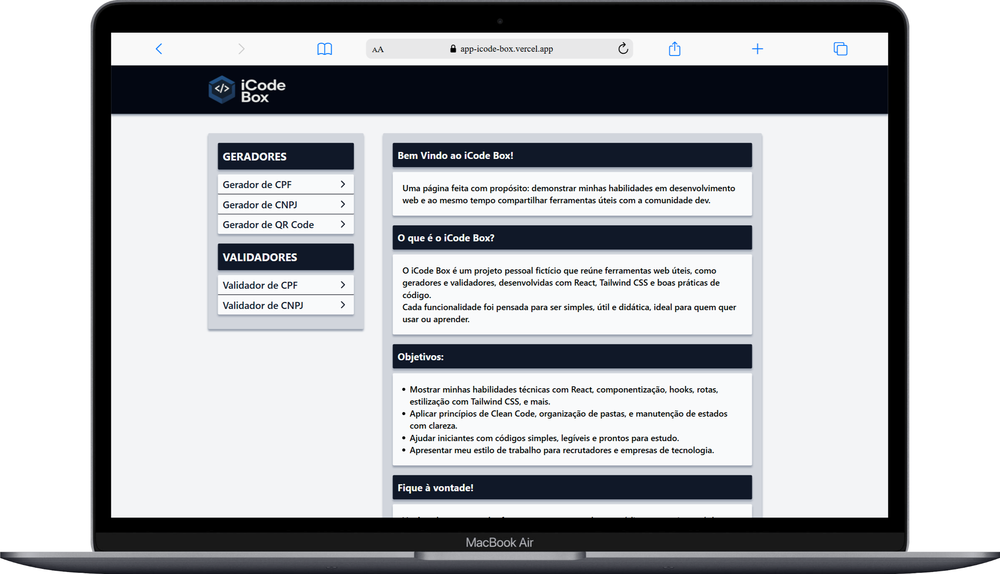
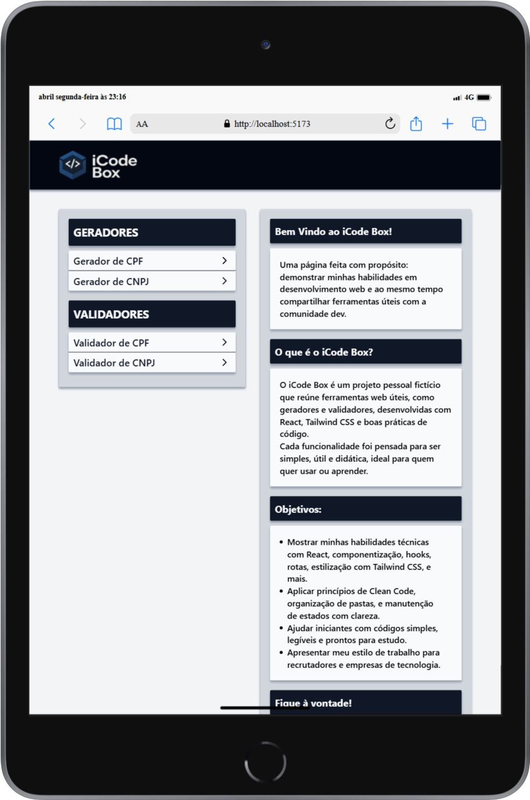
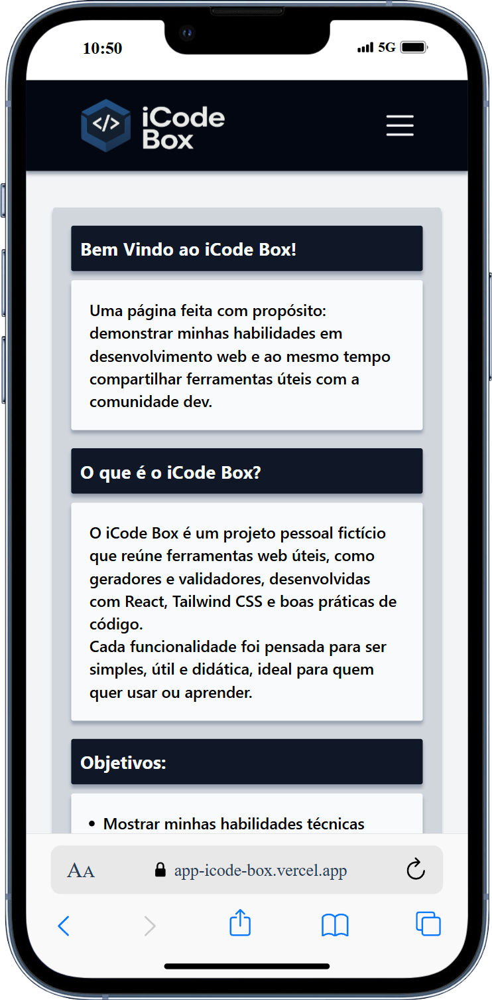

# App - iCode Box
Projeto criado com React + Vite com o objetivo de apresentar minhas habilidades práticas como desenvolvedor fullstack.

## Descrição
Este projeto foi desenvolvido para aprimorar minhas habilidades como desenvolvedor fullstack, colocando em prática conceitos e tecnologias que domino.

## Funcionalidades
- [x] Sidebar com navegação organizada entre ferramentas de Geradores e Validadores de dados.
- [x] Ferramentas que validam e geram CPF, CNPJ com base em entradas do usuário. (Mais ferramentas em desenvolvimento)
- [x] Layout responsivo para Desktop, Tablet e Mobile.
- [ ] Botão para alternar entre os idiomas Português (Brasil) e Inglês. (Em desenvolvimento)

## Tecnologias Utilizadas
- HTML: Linguagem de marcação para estruturação do conteúdo da web.
- CSS: Linguagem de estilo para o conteúdo da web.
- TailwindCSS: Framework utilitário para estilização rápida e responsiva.
- JavaScript (ES6+): Linguagem de programação utilizada para adicionar interatividade ao site.
- Node.js: Ambiente de execução JavaScript do lado do servidor, utilizado para criar aplicações backend escaláveis e performáticas.
- React: Biblioteca JavaScript para construção de interfaces de usuário.​
- Vite: Ferramenta de build rápida e moderna para projetos front-end.
- Lucide: Biblioteca de ícones open-source baseada no Feather Icons, utilizada para adicionar ícones leves e personalizáveis à interface da aplicação.

## 📸 Screenshots
<div align="center">
  <h3>Versão para Desktop</h3>
  
</div>
<br>

<div align="center">
  <h3>Versão para Tablet</h3>
  
</div>
<br>

<div align="center">
  <h3>Versão para Mobile</h3>
  
</div>

##  Como rodar o projeto localmente
## Clone o repositório
```bash
git clone https://github.com/jcddsj01/app-icode-box.git
```

## Acesse a pasta do projeto
```bash
cd app-icode-box
```

## Instale as dependências
```bash
npm install
```

## Inicie o servidor de desenvolvimento
```bash
npm run dev
```

## Abra no navegador
```bash
http://localhost:5173
```

## 📁 Estrutura de Pastas
|---| public<br>
|-----| favicon<br>
|-----| screenshots<br>
|-------| portuguese<br>
|---| src<br>
|-----| assets<br>
|-----| components<br>
|-----| pages<br>
|-------| generator<br>
|-------| validator<br>
|-----| routes<br>

## Deploy
O projeto está disponível online:
https://app-icode-box.vercel.app/

## Contato
Sinta-se à vontade para me contatar através dos links abaixo:<br>
E-mail - jcddsj01@outlook.com<br>
Linkedin - https://www.linkedin.com/in/jose-carlos-703821254/

## Licença<br>
MIT License. Você pode usar este projeto como referência para criar o seu próprio portfólio.

---

# App - iCode Box
Project created with React + Vite with the aim of presenting my practical skills as a fullstack developer.

## Description
This project was developed to improve my skills as a fullstack developer, putting into practice concepts and technologies that I have mastered.

## Features
- [x] Sidebar with organized navigation between Data Generator and Validator tools.
- [x] Tools that validate and generate CPF, CNPJ based on user input. (More tools in development)
- [x] Responsive layout for Desktop, Tablet and Mobile.
- [ ] Button to switch between Portuguese (Brazil) and English languages. (In development)

## Technologies used
- HTML: Markup language for structuring web content.
- CSS: Style language for web content.
- TailwindCSS: Framework utility for fast and responsive styling.
- JavaScript (ES6+): Programming language used to add interactivity to the site.
- Node.js: Server-side JavaScript execution environment used to create scalable and performant backend applications.
- React: JavaScript library for building user interfaces.
- Vite: Ferramenta de build rápida e moderna para projetos front-end.
- Lucide: Open-source icon library based on Feather Icons, used to add lightweight, customizable icons to the application interface.

## 📸 Screenshots
(In development)

##  How to run the project locally
## Clone the repository
```bash
git clone https://github.com/jcddsj01/app-icode-box.git
```

## Access the project folder
```bash
cd app-icode-box
```

## Install the dependencies
```bash
npm install
```

## Start the development server
```bash
npm run dev
```

## Open in browser
```bash
http://localhost:5173
```

## 📁 Folder Structure
|---| public<br>
|-----| favicon<br>
|-----| screenshots<br>
|-------| portuguese<br>
|---| src<br>
|-----| assets<br>
|-----| components<br>
|-----| pages<br>
|-------| generator<br>
|-------| validator<br>
|-----| routes<br>

## Deploy
The project is available online:
https://app-icode-box.vercel.app/

## Contact
Feel free to contact me via the links below:<br>
E-mail - jcddsj01@outlook.com<br>
Linkedin - https://www.linkedin.com/in/jose-carlos-703821254/

## License<br>
MIT License. You can use this project as a reference to create your own portfolio.
